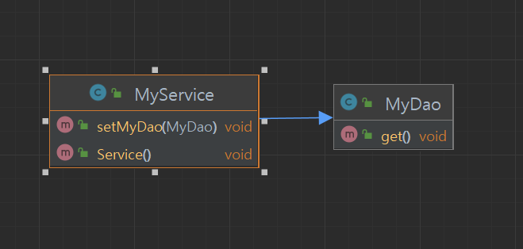

## ApplicationContext
- ApplicationContext는 다양한 인터페이스를 상속받고 있다.
- 스프링 컨테이너의 핵심 인터페이스

      org.springframework.context
      Interface ApplicationContext

      
- 그중에서도 BeanFactory도 ApplicationContext는 상속받는다.

      org.springframework.beans.factory
      Interface BeanFactory

---

## ApplicationContext를 구현하고 있는 대표적인 클래스

- CLASSPATH에서 XML설정파일을 읽어들여 동작한다.

        org.springframework.context.support
        Class ClassPathXmlApplicationContext

---

## 스프링 프레임워크의 핵심 모듈

- Core Container 부분이 가장 핵심
- Gradle에서 아래의 라이브러리를 추가한다.

      implementation group: 'org.springframework', name:
      'spring-context', version: '5.3.23'

- 외부 개발을 위한 MVC관련 라이브러리
- 데이터베이스 정보를 읽어오기 위한 것들

---

# Spring ApplicationContext를 사용해보자

    package com.example.spring02;

    import exam.Book;
    import org.springframework.context.ApplicationContext;
    import org.springframework.context.support.ClassPathXmlApplicationContext;

    public class SpringApplicationContextExam {
        public static void main(String[] args){
        // 인스턴스를 인터페이스 타입을 참조할 수 있다.
        ApplicationContext context = new ClassPathXmlApplicationContext("applicationContext.xml"); <- 여기서 applicationContext.xml 설정파일은 ClassPath에 있어야 한다. 인텔리제이에서 java폴더와 resources 폴더가 ClassPath이다.
        // object 타입으로 반환하기 때문에 Book 으로 형변환을 해주는 것이다.
        // Book book1 = (Book)context.getBean("book1");
        Book book1 = context.getBean("book1", Book.class);
        book1.setTitle("즐거운 Spring Boot");
        book1.setPrice(5000);

        System.out.println(book1.getTitle());
        System.out.println(book1.getPrice());

        Book book2 = (Book)context.getBean("book2");
        System.out.println(book2.getTitle());
    }
}

---

# MyService & MyDao 클래스다이어그램
- 프로그래머가 직접 인스턴스를 생성하고 주입하는 방법
- 연관관계
    - MyService가 MyDao를 가진다.

- setter 주입

        MyService myService = new MyService();
        MyDao myDao = new MyDao();
        MyService.setMyDao(MyDao);

- 생성자에 주입

        MyService myService = new MyService(new MyDao());

---

# Spring 설정으로 주입

    MyService myService = new MyService();
    MyDao myDao = new MyDao();
    MyService.setMyDao(MyDao);

    <bean id="myService" class="com.example.spring02.component.MyService">
    <!-- setMyDao를 호출하는 프로퍼티 -->
        <property name="myDao" ref="myDao"></property>
    </bean>
    <bean id="myDao" class="com.example.spring02.component.MyDao"></bean>

xml파일로 선언적으로 의존성을 주입한다. -> ApplicationContext가 Bean을 관리한다.

---

스프링 초반에 xml파일을 많이 사용함 -> 어려워함, 에러 체크 안됨 -> 짜증

다른 방법은 없나? ->  AnnotationConfigApplicationContext

# Annotation을 이용한 설정

- Spring 3.0부터 등장
- Annotation 기반 (Java Config, Component Scan)

      org.springframework.context.annotation
      Class AnnotationConfigApplicationContext

---

